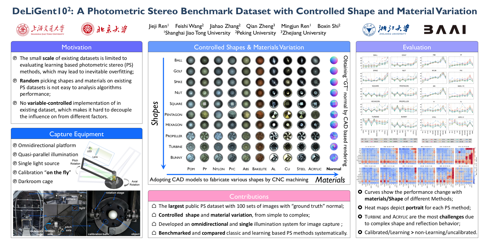
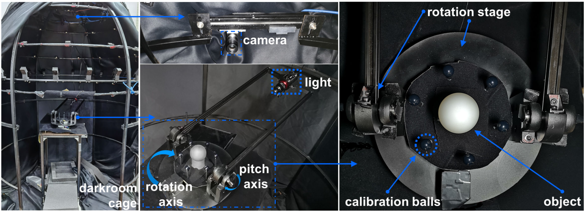
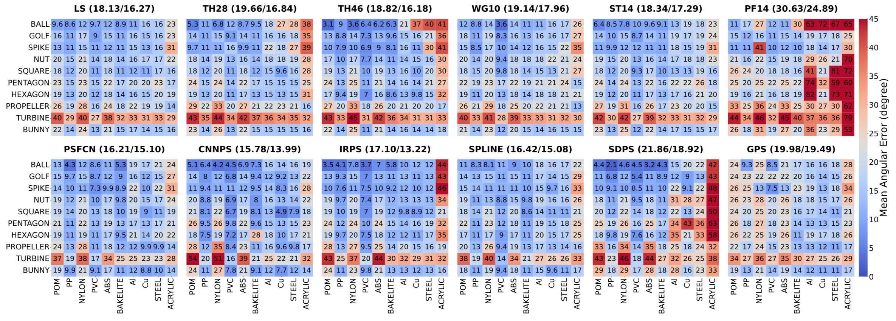

<p style="text-align:justify">Evaluating photometric stereo using real-world dataset is important yet difficult. Existing datasets are insufficient due to their limited scale and random distributions in shape and material. This paper presents a new real-world photometric stereo dataset with “ground truth” normal maps, which is 10 times larger than the widely adopted one. More importantly, we propose to control the shape and material variations by fabricating objects from CAD models with carefully selected materials, covering typical aspects of reflectance properties that are distinctive for evaluating photometric stereo methods. By benchmarking recent photometric stereo methods using these 100 sets of images, with a special focus on recent learning based solutions, a 10×10 shape-material error distribution matrix is visualized to depict a “portrait” for each evaluated method. From such comprehensive analysis, open problems in this field are discussed. </p>
<br><br>


# Datatset
100 objects matrix with 10 shapes-by-10 materials<br>
<table>
  <tr>
    <th>Shapes</th>
    <th>Ball</th>
    <th>Golf</th>
    <th>Spike</th>
    <th>Nut</th>
    <th>Square</th>
    <th>Pentagon</th>
    <th>Hexagon</th>
    <th>Propeller</th>
    <th>Turbine</th>
    <th>Bunny</th>
  </tr>
  <tr>
    <td>Materials</td>
      <td>Pom</td>
      <td>Pp</td>
      <td>Nylon</td>
      <td>Pvc</td>
      <td>Abs</td>
      <td>Bakelite</td>
      <td>Al</td>
      <td>Cu</td>
      <td>Steel</td>
      <td>Acylic</td>
  </tr>
</table>
<br><br>


# Equipment

Out cpature setups.
<br><br>


## Results

curve map
heatmap
<br><br>


## Files
- Paper([PDF](./imgs/pdfs/00793.pdf))
- Supplement([PDF](./imgs/pdfs/00793-supp.pdf))
- Dataset([DownLoad.zip](1.2.3.4/dataset/xxx.zip))
- <font size=3 color=dodgerblue>[Evaluation WebSite](http://120.27.211.155:8501)</font>
<br/><br/>


## Citations
```bib
@InProceedings{Ren_2021_CVPR,
    author    = {Ren, Jieji and Wang, Feishi and Zhang, Jiahaoand Zheng, Qian and Ren Mingjun and Shi, Boxin},
    title     = {DiLiGenT102: A Photometric Stereo Benchmark Dataset with Controlled Shape and Material Variation},
    booktitle = {Proceedings of the IEEE/CVF Conference on Computer Vision and Pattern Recognition (CVPR)},
    month     = {June},
    year      = {2022},
    pages     = {0000-0000}
}

```
<br><br>


## Authors
[Jieji Ren](), [FeiShi Wang](), [Jiahao Zhang](), [Qian Zheng](), [Mingjun Ren](), [Boxing Shi]()


<br><br>
---
[<--- Back to Main Page <--- ](./)


