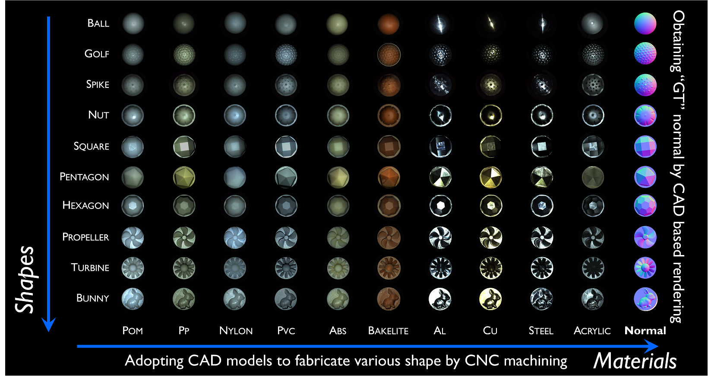
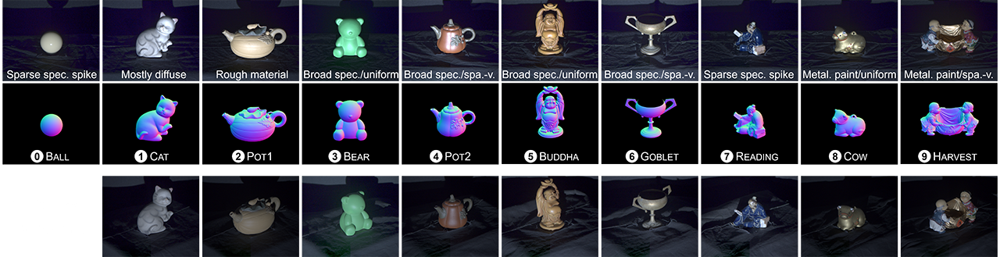

**PhotometricStereo** is compuational imaging methods, which can recover surface normal map and reflection characteristics from various directionl illumination encoding observe images.

-- 
# Datasets
Description of PS Datset

## [DiLiGenT102](./diligent102.html)

 

## [DiLiGenT](https://sites.google.com/site/photometricstereodata/single)

 

--- 

Contact: shiboxin@pku.edu.cn
