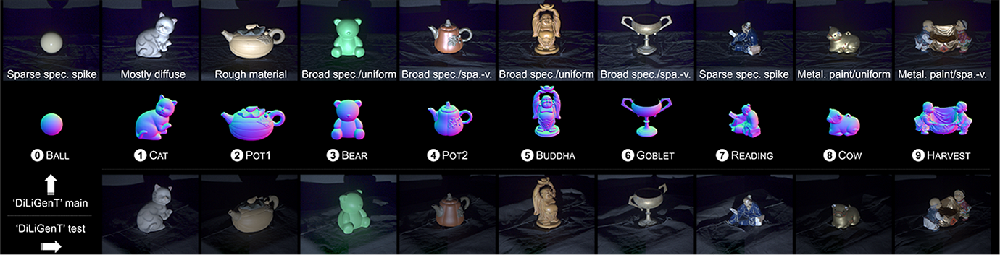
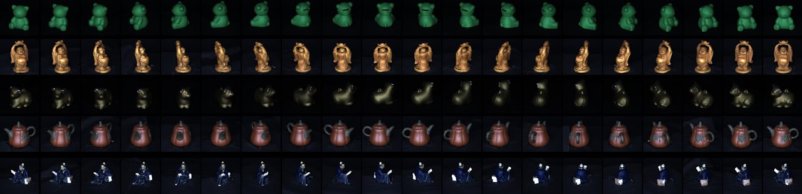

**PhotometricStereo** is compuational imaging method, which can recover surface normal map and reflection characteristics from various directionl illumination encoding observe images.

---
# Datasets
We proposed datasets to benchmark photometric stereos (PS) methods.
  

## [DiLiGenT-Pi](./diligentpi.html)
DiLiGenT-Pi Dataset contains 30 near-planar and rich-detail objects with 4 group materials combinations. Precise details are measured and diverse materials are designed to evaluate the shape details recover performance of PS methods. 

  

## [DiLiGenT102](./diligent102.html)
DiLiGenT102 Dataset contains 100 objects with 10 shapes and 10 materials combinations. With controlled shapes and materials, one can evaluate the performance of each PS method on each dimension independently. 

  

## [DiLiGenT](https://sites.google.com/site/photometricstereodata/single)
We build the ‘DiLiGenT’ photometric stereo image dataset with calibrated Directional Lightings, objects of General reflectance, and ‘ground Truth’ shapes (normals) for orthographic projection and single-view setup. Based on our dataset, we quantitatively evaluate state-of-the-art photometric stereo methods for general non-Lambertian materials and unknown lightings to analyze their strengths and limitations. 

  

## [DiLiGenTMV](https://sites.google.com/site/photometricstereodata/mv)
We extend single-view dataset to the multi-view edition as ‘DiLiGenT-MV’. This new dataset contains images of 5 objects of complex BRDFs taken from 20 views. and in each view, 96 calibrated point light sources are used. The ‘ground truth’ shape is available for quantitative evaluation. This ‘DiLiGenT-MV’ can be used to evaluate multi-view stereo methods under complex materials for lighting, be used to evaluate conventional single-view photometric stereo algorithms by treating each view independently. 

 

--- 
